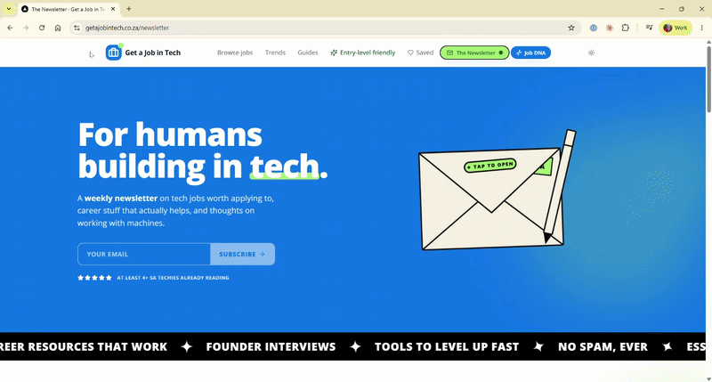
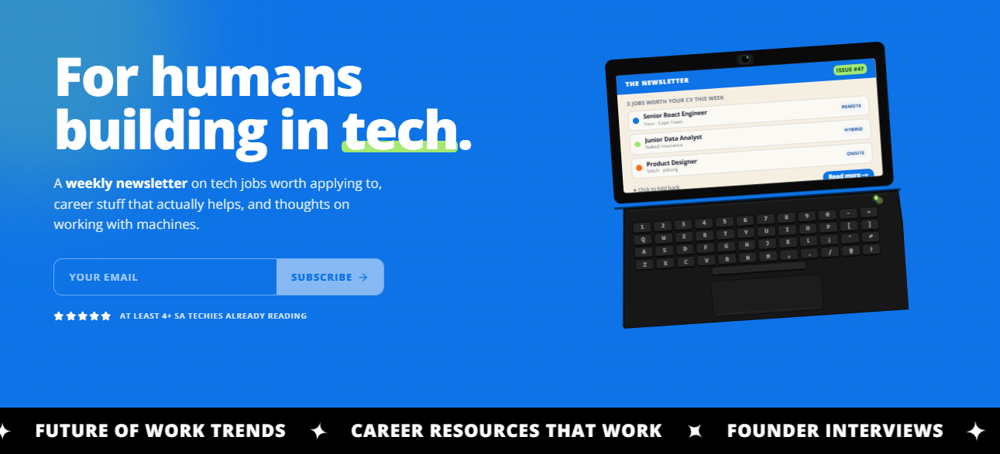
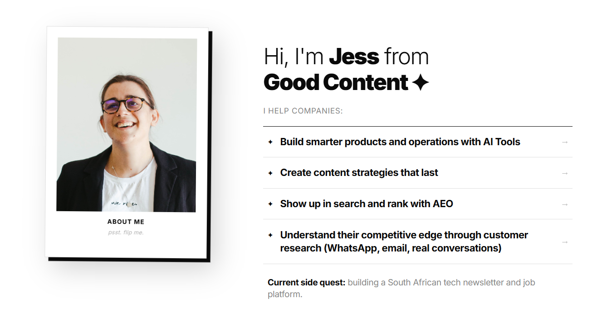

<h1 align="center">hey, i'm jess ✦</h1>

  Strategic Operator · Social Worker → Tech · Cape Town

  
  
  

10+ years designing systems, leading teams, and helping early-stage orgs scale — first as a social worker, then in tech ops. Most recently Head of Operations at CodeSpace ✦

I bring software dev skills, mixed-methods research, systems thinking, and an unexpectedly useful social work background to complex business problems. Currently open to projects and my next role — reach out, and let's do some good work.

## What I do

I help companies **build smarter products and operations with AI tools**, create content strategies that actually last, show up in search with AEO, and understand their edge through real customer research — WhatsApp, email, real conversations.

## Things I'm building

<table>
<tr>
<td width="40%" valign="top">

</td>
<td width="60%" valign="top">

**[Get a Job in Tech](https://getajobintech.co.za)**

SA's friendliest tech job board — clean listings, plain-English summaries, and honest green/orange flags. I built the site **and** the self-healing AI pipeline that feeds it nightly.

`Next.js` `Supabase` `n8n` `OpenAI`

[→ Read the case study](https://github.com/jesscancode/tech-job-scraper-case-study)

</td>
</tr>
<tr><td colspan="2"> </td></tr>
<tr>
<td width="40%" valign="top">

</td>
<td width="60%" valign="top">

**[The Newsletter](https://www.getajobintech.co.za/newsletter)**

A weekly read on tech jobs worth applying to, career stuff that actually helps, and thoughts on working with machines. For humans building in tech.

`Weekly` `Free` `SA tech`

[→ Subscribe](https://www.getajobintech.co.za/newsletter)

</td>
</tr>
<tr><td colspan="2"> </td></tr>
<tr>
<td width="40%" valign="top">

 

</td>
<td width="60%" valign="top">

**[Good Content ✦](https://creategoodcontent.com)**

AI ops and strategy consultancy — helping companies build smarter with AI tools, create content strategies that last, and understand their edge through real customer research.

`AI strategy` `Content` `Ops`

[→ creategoodcontent.com](https://creategoodcontent.com) · [Email](mailto:jess@creategoodcontent.com) · [WhatsApp](https://wa.me/27725449049)

</td>
</tr>
<tr><td colspan="2"> </td></tr>
<tr>
<td width="40%" valign="top">

<!-- add gif:  -->

</td>
<td width="60%" valign="top">

**claude-like-a-baby-engineer**

A toolkit that makes Claude Code help you become an engineer not just a vibe coder. Really about **learning as you build** — for new developers and product people shipping safe, scalable software with AI.

`AI workflows` `Node` `Git`

</td>
</tr>
<tr><td colspan="2"> </td></tr>
<tr>
<td width="40%" valign="top">

<!-- add gif:  -->

</td>
<td width="60%" valign="top">

**Full Art**

Semantic search over Pokémon card **art** — find a card by what the picture shows (*"pikachu in the rain"*), not its name. A vision model reads every card; embeddings + pgvector make it searchable. Born from my own card hunt.

`Computer vision` `Embeddings` `pgvector`

</td>
</tr>
</table>

## What I bring

| | |
|---|---|
| **Operations & strategy** | Business strategy · org design · competitive intelligence · GTM · product-market fit |
| **People & change** | Team leadership · people management · change management · crisis intervention · stakeholder engagement |
| **Research & content** | Mixed-methods research · content strategy · AEO · learning experience design · behaviour-change design |
| **Building with AI** | Systems thinking + real AI tools to ship working products — actual code, not slides |

## Building with

  
  
  
  
  
  
  
  
  
  
  
  
  
  

## Off the clock

Hanging out with my senior dog, Forrest · Neapolitan pizza dough 🍕 · TCG Vending and learning competitive Pokemon TCG · Helldivers 2 (for Managed Democracy) · Engine-building board games like Wingspan · and an *arguably unreasonable* quest to find one specific Pokémon card — Detective Pikachu #098/SV-P. If you have leads, you know what to do.

